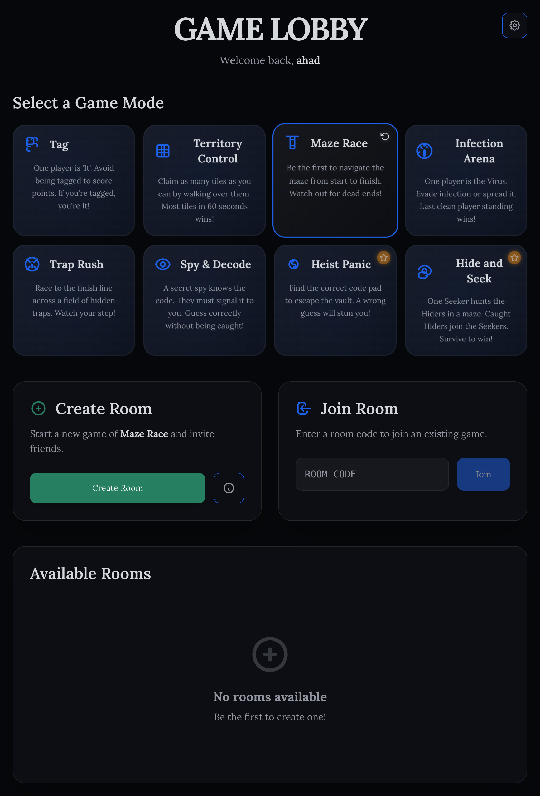

# 🚀 Pixel Arena 🚀

Pixel Arena is a real-time, browser-based multiplayer mini-game platform. Create a room, share the code with your friends, and compete in a variety of fast-paced, exciting game modes!



**[➡️ Live Demo Coming Soon!](#)**

---

## 🎮 Game Modes

Pixel Arena features a growing collection of unique games, each with its own objective and rules:

* **Tag:** The classic playground game. Avoid being 'It' to score points.
* **Territory Control:** Claim as much of the grid as possible with your color before time runs out.
* **Maze Race:** Be the first player to navigate a procedurally generated maze and reach the exit.
* **Dodge the Spikes:** A survival game where you must avoid a constant barrage of falling spikes.
* **Infection Arena:** One player is the 'Virus'. Evade infection or spread it. Last survivor wins!
* **Trap Rush:** Race to the finish line across a field of hidden, debilitating traps.
* **Spy & Decode:** A game of social deduction. A secret spy must signal a code to their allies without getting caught.

## ✨ Features

* **Real-time Multiplayer:** Powered by WebSockets (Socket.IO) for instant action.
* **Room System:** Create private rooms or join existing ones with a simple code.
* **Multiple Game Modes:** A diverse selection of games to keep the fun going.
* **Responsive Design:** Play seamlessly on both desktop and mobile devices.
* **Mobile Controls:** An on-screen virtual joystick for an intuitive mobile experience.
* **Persistent Username:** Your chosen name is saved locally for quick re-entry.

## 🛠️ Tech Stack

The project is structured as a monorepo with a separate client and server.

* **Frontend (client/):**

  * **Framework:** [React](https://reactjs.org/)
  * **Language:** [TypeScript](https://www.typescriptlang.org/)
  * **Build Tool:** [Vite](https://vitejs.dev/)
  * **Styling:** [Tailwind CSS](https://tailwindcss.com/)
  * **State Management:** React Context API
  * **Communication:** [Socket.IO Client](https://socket.io/docs/v4/client-api/)
* **Backend (server/):**

  * **Runtime:** [Node.js](https://nodejs.org/)
  * **Framework:** [Express](https://expressjs.com/)
  * **Language:** [TypeScript](https://www.typescriptlang.org/)
  * **Communication:** [Socket.IO](https://socket.io/)

## 📂 Project Structure

```
/
├── client/          # React Frontend (Vite + TS)
│   ├── public/
│   ├── src/
│   ├── package.json
│   └── vite.config.ts
│
├── server/          # Express Backend (Node.js + TS)
│   ├── src/
│   ├── package.json
│   └── tsconfig.json
│
└── README.md
```

## 🚀 Getting Started

Follow these instructions to set up and run the project locally.

### Prerequisites

* [Node.js](https://nodejs.org/en/) (v18.x or later recommended)
* [npm](https://www.npmjs.com/) or [yarn](https://yarnpkg.com/)

### 1. Clone the Repository

```sh
git clone https://github.com/your-username/pixel-arena.git
cd pixel-arena
```

### 2. Set Up the Backend

The server runs on port `3000` by default.

```sh
# Navigate to the server directory
cd server

# Install dependencies
npm install

# Create an environment file from the example
cp .env.example .env

# Start the development server
npm run dev
```

### 3. Set Up the Frontend

In a new terminal window, set up the client. The client runs on port `5173` by default.

```sh
# Navigate to the client directory from the root
cd client

# Install dependencies
npm install

# Create an environment file from the example
cp .env.example .env

# Start the development server
npm run dev
```

You should now be able to access the application at `http://localhost:5173`.

## ⚙️ Environment Variables

The application requires environment variables for both the client and server.

#### `server/.env`

This file configures the server port and the allowed origin for CORS.

```env
PORT=3000
# The URL of your running frontend client
FRONTEND_URL=http://localhost:5173
```

#### `client/.env`

This file tells the frontend where to find the backend server.

```env
# The URL of your running backend server
VITE_BACKEND_URL=http://localhost:3000
```

## 📜 Available Scripts

### Server (`/server`)

* `npm run dev`: Starts the server in development mode with hot-reloading using `ts-node-dev`.
* `npm run build`: Compiles the TypeScript code to JavaScript in the `/dist` directory.
* `npm run start`: Starts the compiled server from the `/dist` directory.

### Client (`/client`)

* `npm run dev`: Starts the Vite development server.
* `npm run build`: Builds the application for production.
* `npm run preview`: Serves the production build locally for testing.

---

_This project was built for demonstration and fun. Feel free to fork, contribute, or get inspired!_
